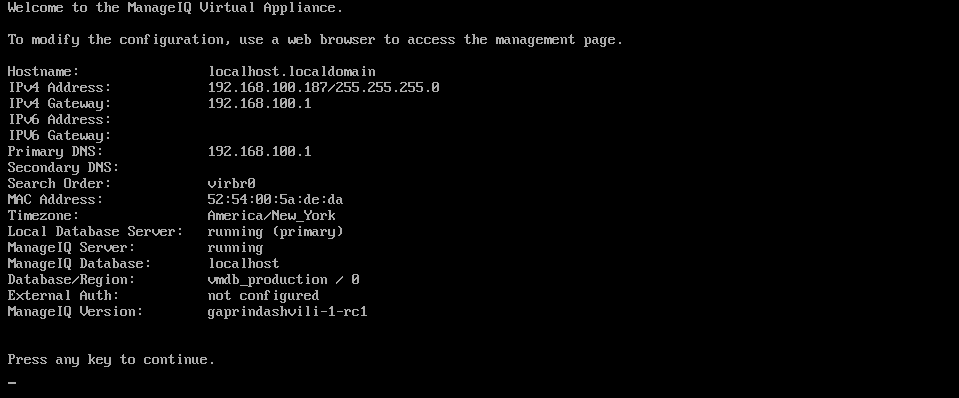
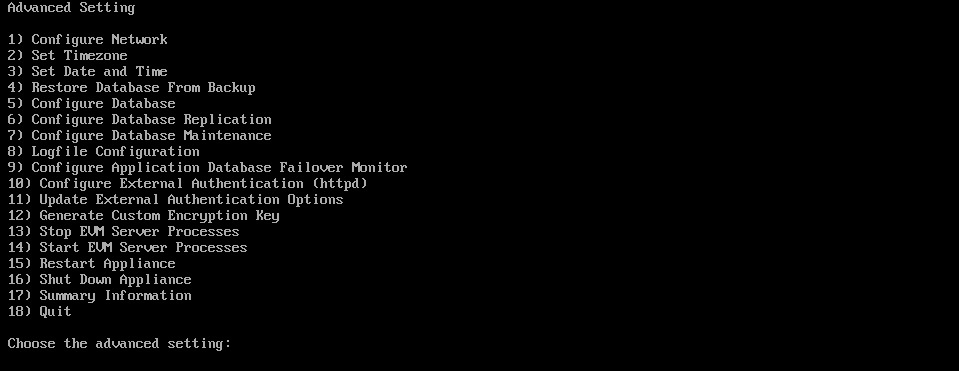
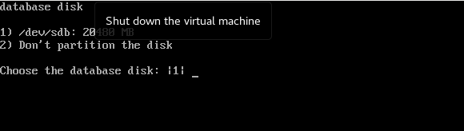

## Appliance Console

Appliance Console is the command line ManageIQ configuration platform. To access ManageIQ configuration through this, we need to start the appliance with using SSH key or login credentials.

### Configuration setting
- Start the appliance with virtual machine and this opens a terminal console.
- We need to login with the authentication credentials i.e. Username and Password.
- This will login us to the VM with the previous login session details.
- We will enter `appliance_console` for menu options.

- After entering the command we can see the summary information of the virtual machine.
- We can view menu or advanced settings to configure after clicking any key.
- We will get a list of 18 different options to configure ManageIQ. We just need to select the number associated with the item we wish to work on and the further things will be prompted by the console itself. This we will be studing here.

| Note | We can also login through SSH. For that we require IP address. We can use the `ssh` command in our case   `ssh root@192.168.188.187`
|------|:------|

### Summary Information

Summary information states the current status of our ManageIQ virtual machine. Lets see some of them briefly.

#### Hostname
This is a hostname specified for the ManageIQ appliance. We can change this using advanced settings.

#### IPV4 Address
This is a address which is used to access ManageIQ dashboard by a web browser. That we will be studing in [chapter 1.4](configuration.md).

#### Timezone
It states the time zone which we prefer for our ManageIQ virtual machine. We can change the timezone and that we will be studing it further.

#### Local Database Server
It states that the local database server is running or not running currently i.e. the state of the local database server.

#### ManageIQ Server
The ManageIQ server status can be identified from this whether it is active or not.

### Advanced Settings in ManageIQ
The moment you login, after Summary information you will receive a set of advanced options for configuring ManageIQ. Lets discuss them in brief.

#### 1. Configure Network
Option 1 lets us configure the network essentials. It includes the *DHCP Network Configuration*, *Set Static Network*, *Test Network Configuration and Set Hostname*.

#### 2. Set Timezone
This helps us to configure the timezone for the appliance console.

#### 3. Set Date and Time
Option 3 allows us to set the Date and Time for the appliance control.

#### 4. Restore Database from Backup
This helps us to let restore the VMDB (Virtual Management DataBase) from the previous setup.

#### 5. Configure Database
It lets us configure the VMDB. Use this to configure the database for the appliance after installing and running it for the first time.

#### 6. Configure Database Replication
This allows us to configure a primary or standby server for VMDB replication.

#### 7. Configure Database Maintenance
Option 7 helps us to configure VMDB maintenance schedule.

#### 8. Logfile Configuration
This helps us configure the log files generated by the ManageIQ machine.

#### 9. Configure Application Failover Monitor
This option helps us to start or stop the VMDB failover monitoring.

#### 10. Configure External Authentication
This allows us to configure authentication. This is done using IPA server.

#### 11. Update External Authentication Options
Option 11 will let us update the external authentication options using IPA server.

#### 12. Generate Custom Encryption Key
This helps us to generate a encryption key. This key is used to encode the plain text password. It follows the Security Content Automation Protocol(SCAP) standard for appliance console.

#### 13. Stop EVM Server Processes
Option 13 helps us to stop all the server processes. We may need this after the maintenance.

#### 14. Start EVM Server Processes
This allows us to start the server processes when it is inactive. We may need to do this after performing maintenance.

#### 15. Restart Application
Option 15 allows us to restart the appliance console. We can do two things here i.e. either restart and clear all log files or just restart the appliance.

#### 16. Shut Down Application
This helps us to stop the appliance and shut down. It shutdown the appliance and all the processes associated with it.

#### 17. Summary Information
Option 17 gives us the complete status of your virtual machine that we have already discussed above.

#### 18.Quit
Quit option helps us leave the ManageIQ application console

 

---

### Issue Faced

The issue faced in this section was regarding the sdb i.e. Standalone DataBase. We specifically wanted our own separate disk as database.

For that we configured database with 20GB disk and tried creating internal database but we were able to see only sdb.

We tried to `resetDatabase` but it did not work due to systemd's var-
opt-rh-rh\\x2dpostgresql95-lib-pgsql.mount.

At the end we had to work with the default database.

---
 
