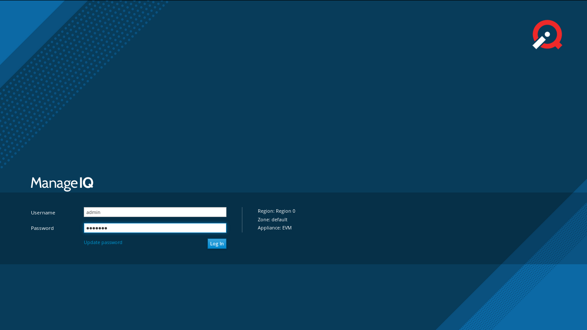
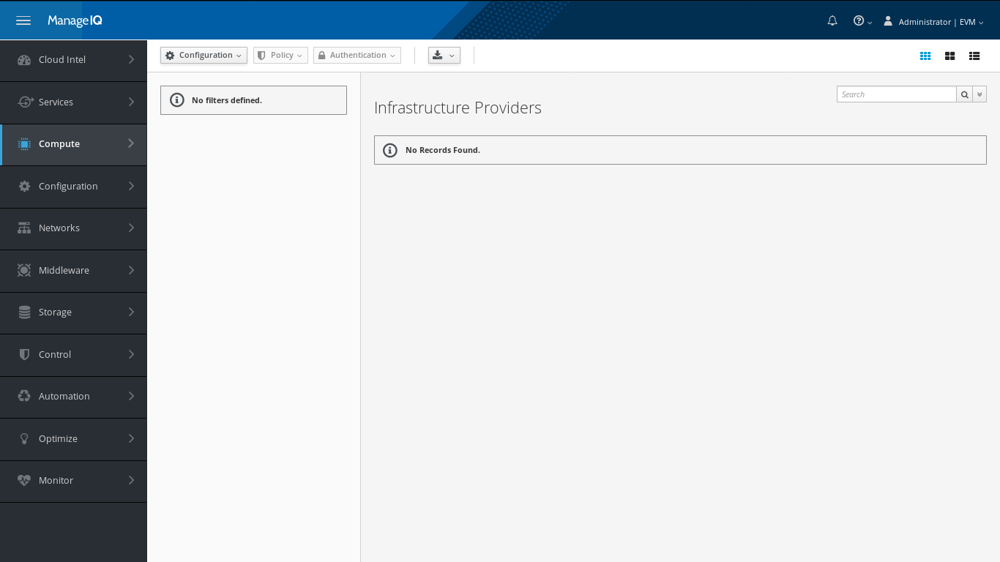
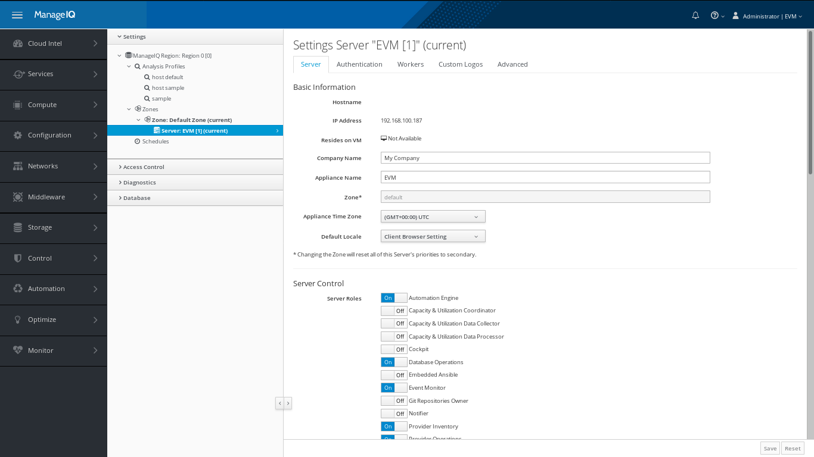
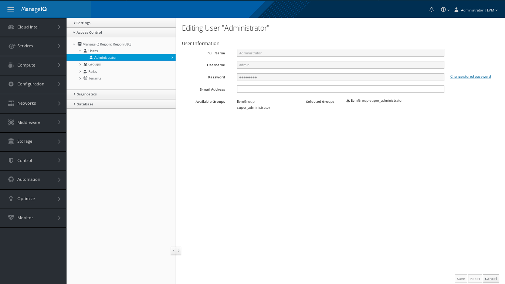
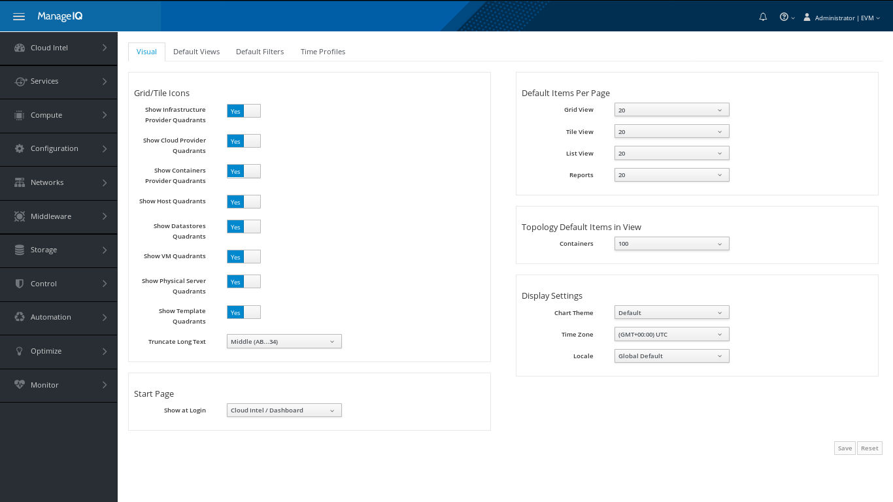

## Basic Configuration

### Launch webportal
In `appliance_console`, we need to check whether ManageIQ Server is up. If not then we can start it by entering digit `14` in the advanced setting.  After that when we hit IPv4 address which is given in `appliance_console` in web browser we can see the ManageIQ's Login page.

### Log In
There are default credentials for ManageIQ. We can change it but we will discuss it later.

- **Login:** admin
- **Password:** smartvm

Now we can see the dashboard which looks like following image

In the extreme left, we can see the vertical navigation bar. We can easily navigate through elements from menus of this navbar.

### Change Configuration
In upper right corner, we can see dropdown menu for EVM. Go to **EVM  &rarr;  Configuration**

Here, we can see

#### In Setting section

- **Hostname, IP Address :** hostname and IP address of appliance is shown.

- **Company Name :** Company Name is shown but we can change it and that name is reflected over interface.

- **Zone, Appliance Time Zone and Default Locale:** You can change default time zone and locale as per wish.

- **Server Control** decides roles of each appliance. So don't enable any options just keep them as it is unless you need any specifically.

| Note | We are going to use Embedded Ansible server role from this menu in upcoming chapter.|
|------|:------|
#### In Access Control

We can change default credentials of User. Also we can use Groups and Role section in appliance for ease.

### My Settings

In EVM's dropdown go to My Settings i.e **EVM &rarr; My Settings**. We can change Visual, Default views, Default Filters and Time Profiles of interface.

That defines apperance of UI as well as Default Start Page. So you can customize it.
