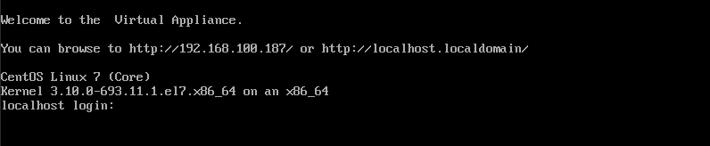

## Get Started

When ManageIQ has to be used in production environment, users normally download virtual appliances and deploy onto virtualization platform like OpenStack or VMware.

There are simple ways to explore ManageIQ. For getting started with ManageIQ, it can run as:
- [Docker](https://enhance-manageiq.github.io/2017-10-10-run-manageiq-using-docker/) - Run ManageIQ as a Docker container
- Vagrant Box
- In Public Cloud such as Google Cloud Platform

For this guide, we will launch ManageIQ virtual appliance on QEmu/KVM. It is then configured to integrate with OpenStack which will be explained in [chapter 2](../chapter2/README.md). It can also connect to other virtualization platforms.

### Download appliance

Let's get started for setup. For this, we require ManageIQ appliance which is available on ManageIQ site. First [download virtual appliance](http://manageiq.org/download/) for QEmu/KVM. We will get _qcow2_ format disk which we use to launch virtual machine(VM).

| Note | Ansible automation feature is supported since ManageIQ Fine releases. It is suggested to download release after ManageIQ Fine version. |
|------|:------|

### Install KVM

Type the following command to install KVM and other necessary packages,

```
# yum install qemu-kvm libvirt libvirt-python virt-install
```

Now we are ready to create a new virtual machine

### Create a Virtual Machine

Firstly, we need to move the downloaded _qcow2_ image to default pool (i.e. /var/lib/libvirt/images/). We can also create a pool to store this image.

Create a new virtual machine and import existing disk image i.e. downloaded disk.

To run well, it should have minimum,
 - 10 GB of RAM
 - 4 virtual CPUs

Create VM using virt-install command:
```
# virt-install --import --name ManageIQ \
--memory 12288 --vcpus 4 --cpu host \
--disk <location_of_the_image>,format=qcow2,bus=virtio \
--network bridge=virbr0,model=virtio \
--os-type=linux \
--os-variant=centos7.0 \
--graphics spice \
```

### Launch Virtual Machine

Start up your virtual machine.
```
# virsh start ManageIQ
```
Once it is booted successfully, it will ask for credentials to login.



### Login to VM

So now we have IP address of the VM. Type this command in host machine terminal to ssh into VM:
```
# ssh root@<ip-address>
```

Login using default credentials:

- **Login:** root
- **Password:** smartvm

Now we have access of *appliance_console* to configure and control ManageIQ server.


