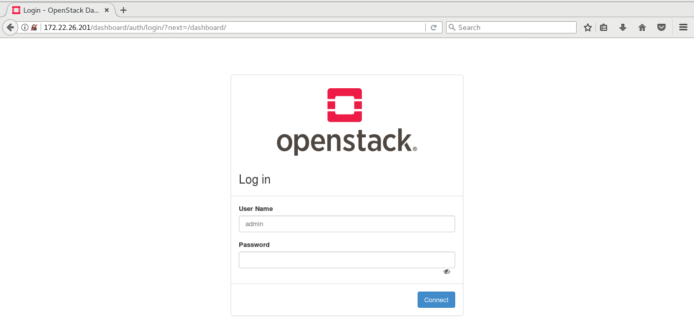

## Get Started

We need to start with installation of OpenStack, We already studied the different components of OpenStack and now here we are going to install OpenStack with pike release using packstack.

[Packstack](https://wiki.openstack.org/wiki/Packstack) is a utility that uses puppet module to deploy various parts of OpenStack on multiple pre installed servers over SSH connection. Till date, it supports only CentOS and Red Hat Enterprise Linux (RHEL).

Pike is the OpenStack release that focus on manageability, scalability and modularity. The features in pike release come from the experience of enabling thousands of private and public clouds, either large or small.

### Installation of OpenStack-pike

As for now, we are going to work with CentOS.

| Warning |For the smooth installation of OpenStack on the machine we need atlease 16GB RAM.|
|------|:------|

After hardware specification, we need to start with the installation of RPM to set up the OpenStack repositories.

In CentOs the *Extras* repo provides the RPM that enables OpenStack repositories. Extras are enabled by default in CentOs. This process is a bit different from the one followed in RHEL.

`$ sudo yum install -y centos-release-openstack-pike`

After this installation, we have to make sure whether these repos are enabled. OpenStack-pike is the release version mentioned here. You can go with any release version of OpenStack.

`$ yum-config-manager --enable openstack-pike`

As a good practice, We need to update the packages

`$ sudo yum update -y`

So next we have to install packstack installer as we have already mentioned that we are going to use packstack for OpenStack.

`$ sudo yum install -y openstack-packstack`

Last step is to run packstack to install OpenStack

`$ sudo packstack --allinone`

This will create a *answer file* for your installation that is present in home directory with *.txt* extension.

After all this process you can login to the OpenStack dashboard with username as admin and you will get the password in keystonerc_admin file in /root directory.

---

### Issue Faced

We faced a issue with the installation of OpenStack in the last step i.e. `$ sudo packstack --allinone`.

That was due to insufficient resources and network. We tried the above procedure again but ended up with lots of errors.

So if at the time of installation of OpenStack using packstack, you get some error and get out of the process; you need to use the answer file. The answer file is with a name like *packstack-answers-20171121-123456.txt*. This answer file is used for refering already set password and other credentials.

We need to fire the command again but using the desired answer file as `$ sudo packstack --answer-file <answer-file-name>`

And further everything went smoothly.

---
 
