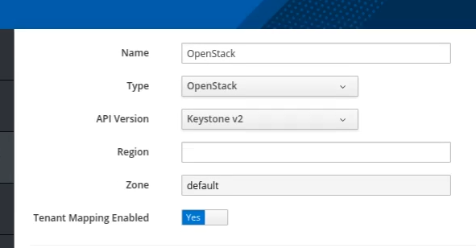
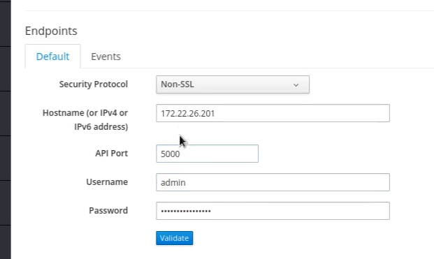
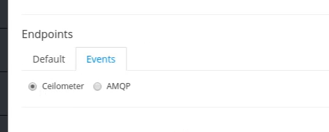
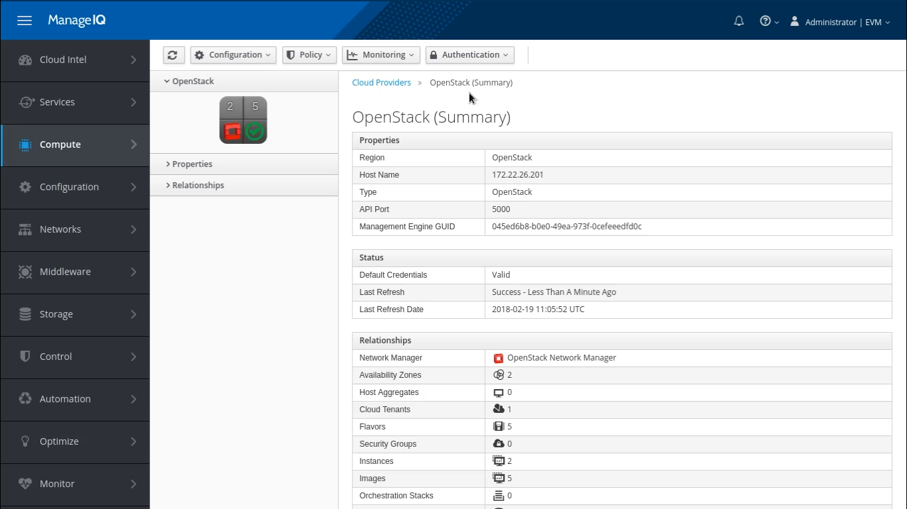
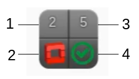
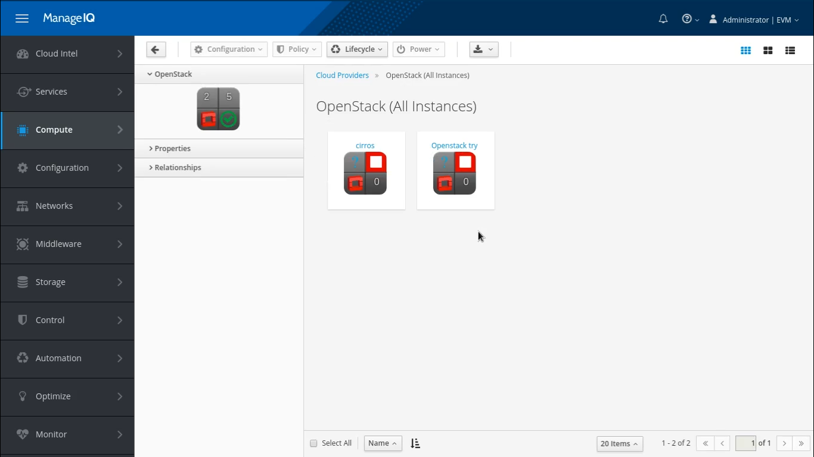

## Integration of OpenStack with ManageIQ

After the entire installation and configuration of OpenStack provider, It must be integrated with ManageIQ.

ManageIQ can manage a variety of external environments, known as providers and managers.

A provider or manager is any system that ManageIQ integrates with for the purpose of collecting data and performing operations.

### Add OpenStack Provider

So here we choose OpenStack for this integration as we are basically working for Infrastructure-as-a-Service.

To add a provider in ManageIQ, We need to login to ManageIQ dashboard.

Navitage to **Compute -> Clouds -> Providers** and then go to **Configuration -> Add a New Cloud Provider**. This will land you on a new screen where you need to provide information about the provider to be integrated.

- Give a name of the provider to add.

- Choose type as "OpenStack" platform from the type list.

- Select a API version of your OpenStack  provider's Keystone service from the list. The default is Keystone v2.

- Next is to select a zone for a provider. Choose whichever is appropriate. By default, it is default.
-
- By default Tenant Mapping is Disabled but you need to enable it.

- In the Endpoints section, There are two tabs i.e. Default and Events.

In Default tab, We need to configure the host and authenticate  details of OpenStack provider.

- To authenticate the provider, Select a security protocol method. SSL allows you to authenticate the provider securely using a certificate authority.

- Enter the hostname or IP Address either IPv4 or IPv6 of the provider.

- In API port, OpenStack uses 5000 port by default.

- Fill in the credentials in Username and password field. The usrename must be privileged and its corresponding password.

| Note |In OpenStack platform, You will get the password in keystonerc_admin file in /root directory.|
|------|:------|

- Validate the details to make sure that ManageIQ can connect to OpenStack provider.

In Events tab under Endpoints section, We need to configure how ManageIQ should receive events from the OpenStack provider.

- If you prefer to use AMQP messaging bus, Select AMQP event service. For this you need to set the public port used by AMQP in API Port and the corresponding credentials. Also validate the credentials to confirm them.

- If you want to use Telemetry service by the OpenStack provider, Select Ceilometer event service.

| Note |To use Ceilometer service you must configure the *notification_driver*. To do so edit the *etc/ceilometer/ceilometer.conf* and set `store_events = true` |
|------|:------|

Here your cloud provider is successfully integrated with ManageIQ. All the instances, images, networks, security groups, etc. are summarized here. It also displays the machine status with its last session details.

| Note |It takes time to integrate the cloud provider and display all its details.|
|------|:------|

The web interface uses virtual thumbnails to represent infrastructure providers. Each thumbnail contains four quadrants by default, which display basic information about each provider:

1 Number of hosts 
2 Management system software 
3 Currently used 
4 Authentication status

You can walk through all these things by just clicking on it.

 

---

### Issue Faced

We faced a issue after the integration of the OpenStack provider. Even after the integration, the details and information of OpenStack provider like instances, images, network, etc were not displayed.

But later we discovered that there were compatibility issues of *Fog Library* in the OpenStack provider with ManageIQ and fog is the Ruby cloud services library to talk to OpenStack clouds.

So it was a need to change the OpenStack version so we downgraded the OpenStack-Pike to OpenStack-Ocata.

And later on everything went on smoothly.

---
 
