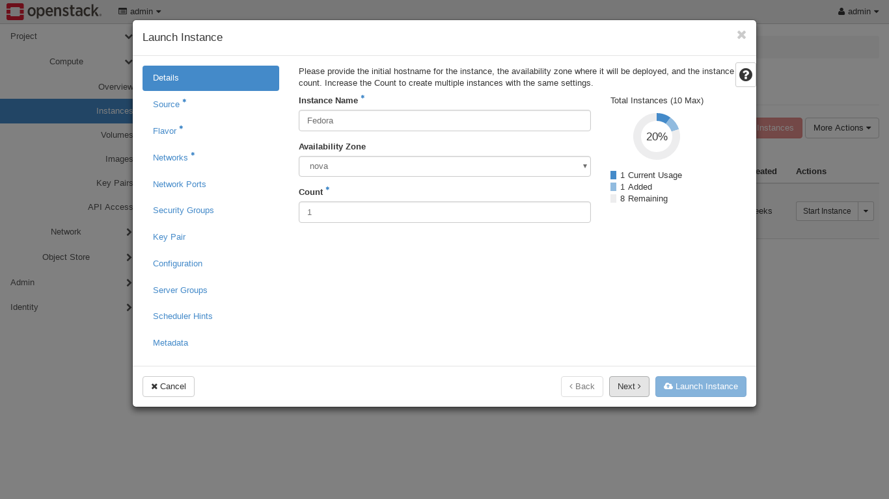
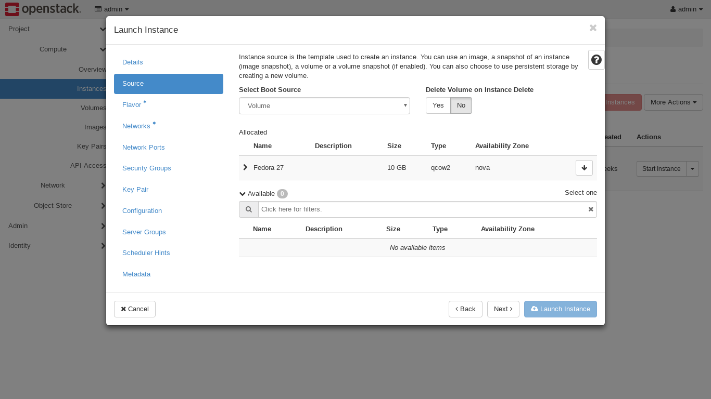
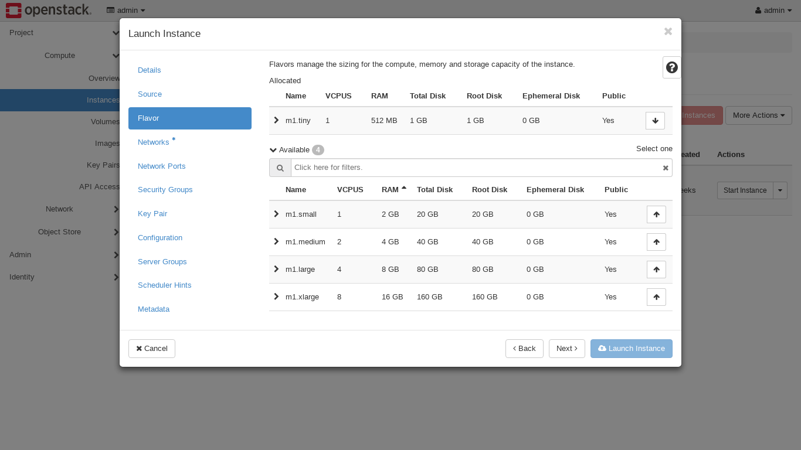
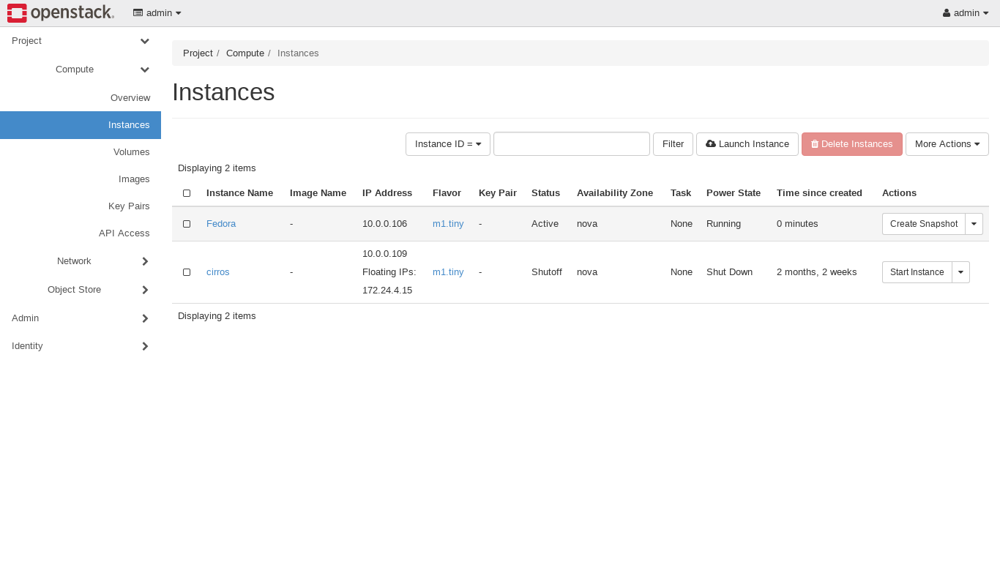

## Launch Instance in OpenStack
Instances are nothing but virtual machines inside the cloud. We can launch instance using images, volumes or by using snapshots of previous instance.

After login, goto **Project &rarr; Compute &rarr; Images** where all the uploaded images are present. User can create several instances from single image.

After creating specified image we need to create specified volume, goto **Project &rarr; Compute &rarr; Volumes &rarr; Create Volume**. To enable persistent storage we need **volume** which is block storage device attached to instance.

### Launch Instance
Goto **Project &rarr; Compute &rarr; Instances &rarr; Launch Instance**

Specify Instance Name, Availability Zone and Count of instances.

In **Source**, We need to select Boot Source from available images and volumes.

**Flavors** manage the sizing for compute, memory and storage capacity of instance.

**Networks** provide communication channels to the instance in cloud.

There are some additional options such as **Network Ports** for extra communication channels, **Security Groups** and **Server Groups** for launching instance in specified group, **Key Pair** to allow SSH for newly created instance, **Configuration**, **Scheduler Hints** and **Metadata**.

Then click on **Launch Instance** button and we can see Active instance in system.

