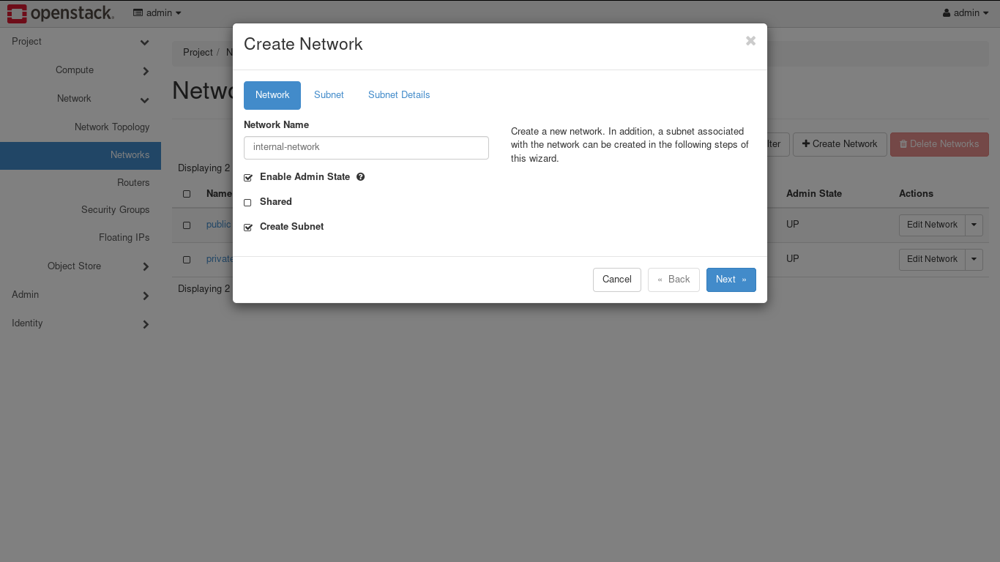
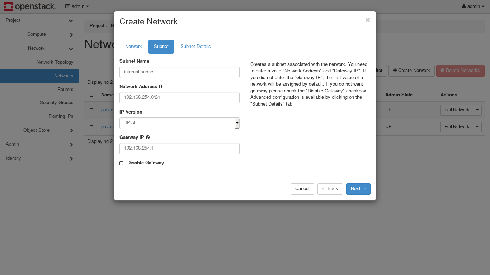
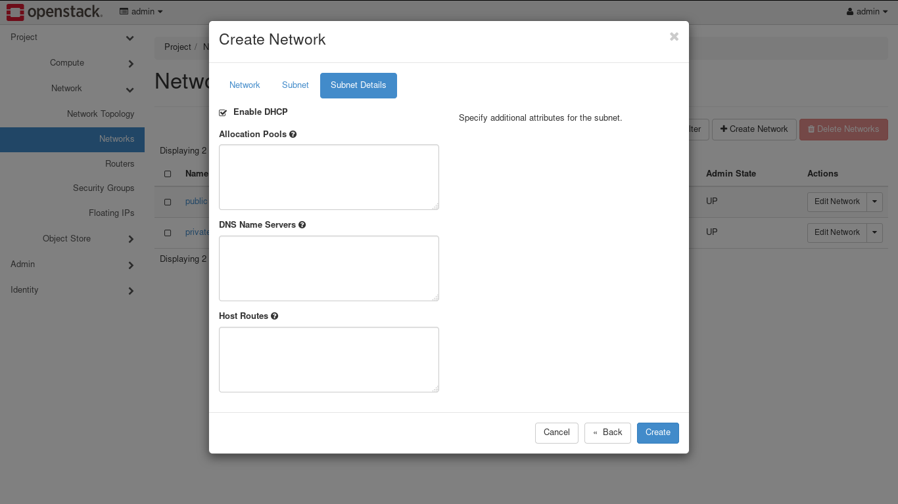
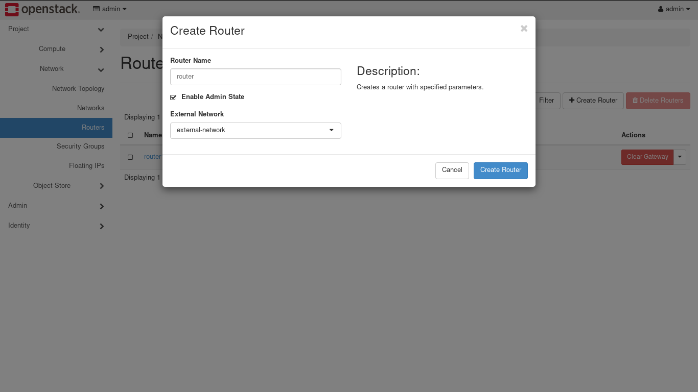
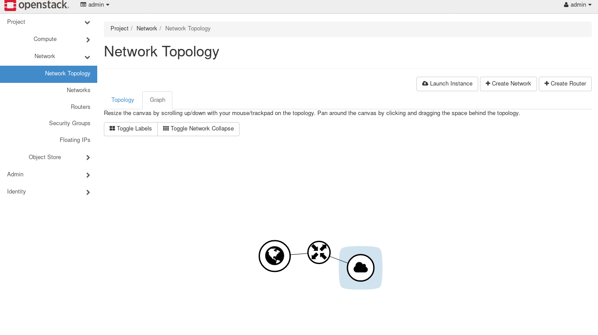

Once the installation of OpenStack is done, we need to configure OpenStack Network to access it's instances.

## Configure OpenStack Network

Login to OpenStack dashboard using admin credentials. Go to **Project &rarr; Networks.** While on this page, hit **Create Network** button and setup internal network as follows:







Next, use the above steps to create external network. Make sure that IP address for external network is in same network range as your compute node IP address range.

On the next step, we need to mark external network as External. To do this, Navigate to **Admin &rarr; Networks** then while editing external network that we created, check External Network option. This is required in order to communicate with instances.

### Create Router

We need to create router to communicate between two networks. Go to **Project &rarr; Network &rarr; Routers** and click on Create Router.



Once router has been created, go to interface tab of that router and click on Add Interface. Select internal network and hit on Submit. We can see the whole network map in **Project &rarr; Network &rarr; Network Topology.**




## OpenStack Configuration

OpenStack has different components like Neutron, Nova etc., those are already mentioned in [chapter2.1](openstack_info.md). Each component uses similar kind of configuration techniques and _ini_ format for configuration files.

An ini is simple text file which contains options as `key=value` pairs and grouped into sections.

```
[DEFAULT]
# Defines which driver to use for controlling virtualization.
compute_driver=libvirt.LibvirtDriver

[api_database]
# Interval between retries of opening a SQL connection. (integer value)
retry_interval=10

```

As required, we need to change this configuration further. On [OpenStack docs](https://docs.openstack.org/ocata/config-reference/config-format.html), provided more information about configuration file format.
