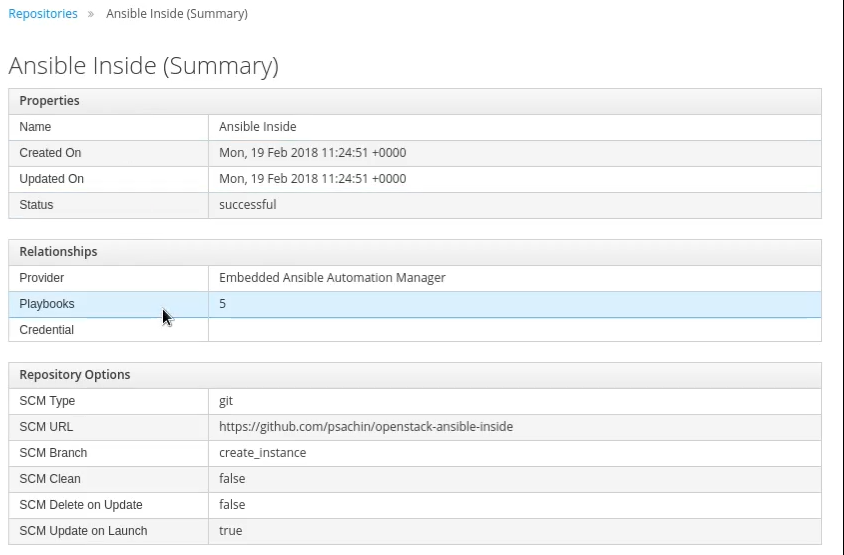

# Embedded Ansible

In ManageIQ after release Fine, Ansible is embedded within ManageIQ itself. Before Fine release, automation was supported in ManageIQ but we had to write a Ruby script which uses custom domain.

Since Fine release automation has been easier in way that we just need to write Ansible playbooks. Embedded Ansible provides integrity to run Playbooks.

After the integration of OpenStack provider with ManageIQ, It is the time to enable *EmbeddedAnsible* Server Role in Server Controls of ManageIQ.

1. Navigate to **Administrator|EVM -> Configuration**. This will land you on the screen of *Server Settings*.

2. Enable the EmbeddedAnsible server role.

3. Click the Save button to carry forward the changes.

| Note |This will take some time depending on the internet speed and appliance specifications.|
|------|:------|

ManageIQ will generate events about EmbeddedAnsible activation in notification section.

You can check the status of the task in ManageIQ by navigating to **Administrator|EVM -> Tasks -> All Tasks tab**.

You can also check that whether the EmbeddedAnsible role has started or not by `vmdb; rake evm:status`.

| Warning |If the Server Role is not started, do check the `log/evm.log` and `log/automation.log` files after execution of `vmdb`.|
|------|:------|

### Add Repository

After the EmbeddedAnsible Server role has successfully started, we need to move ahead to add a git repository of playbooks.

1. Navigate to **Automation -> Ansible -> Repositories** .

2. Walk to **Configuration -> Add New Repository** .

3. Give an appropriate name to the repository.

4. Add a short description about what the repository is exactly.

5. Choose the SCM type from the drop down list. By default, it is Git.

6. Enter the URL of the repository to be added. In our case, we have used a playbook that helps you create a instance, network, group, etc in OpenStack. Refer [this](https://github.com/psachin/openstack-ansible-inside) link for the playbook.

7. Add the SCM credentials from the drop down list whichever is appropriate.

8. SCM Branch field should be filled with the name of the branch.

9. Check the appropriate box for any SCM Update Options.

10. Click on Add button to save the changes.

Once the repository has been added successfully. You can see the files is the playbook in ManageIQ dashboard itself.

It shows all the information regarding the repository like the name, time, status, playbooks, etc. You can easily walk through it on a single click.

| Tip|To know more about Ansible modules for OpenStack, refer this link -> http://docs.ansible.com/ansible/latest/list_of_cloud_modules.html#openstack|
|------|:------|

 

---

### Issue Faced
The installation of ManageIQ - Fine was done with the integration of OpenStack Cloud provider but after enabling EmbeddedAnsible Server role, we faced a issue for not starting that role and generation of lots of events.

Later after checking the `evm.log` file we encountered that to setup embedded ansible we need enterprise licence in ManageIQ - Fine release as it uses Ansible Tower for automation.

But as we didn't had any so we upgraded ManageIQ to its latest stable release Gaprindashvili-1 which use AWX. AWX is open source version of Ansible Tower.

So we shifted to ManageIQ - Gaprindashvili with the integration of OpenStack.

---
 
