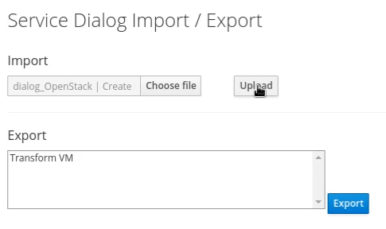
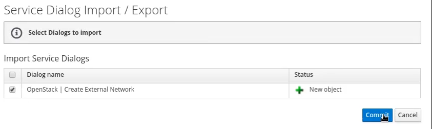
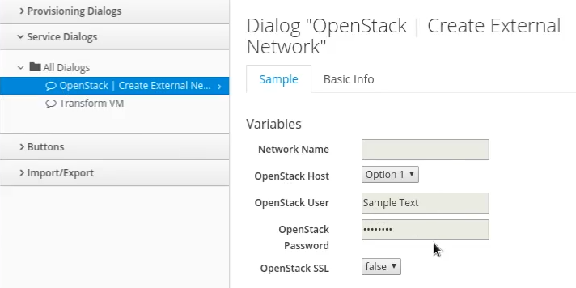
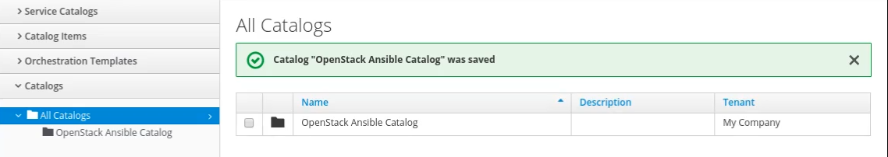
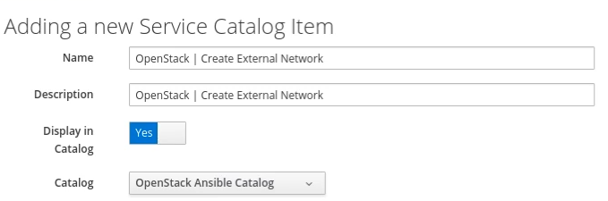
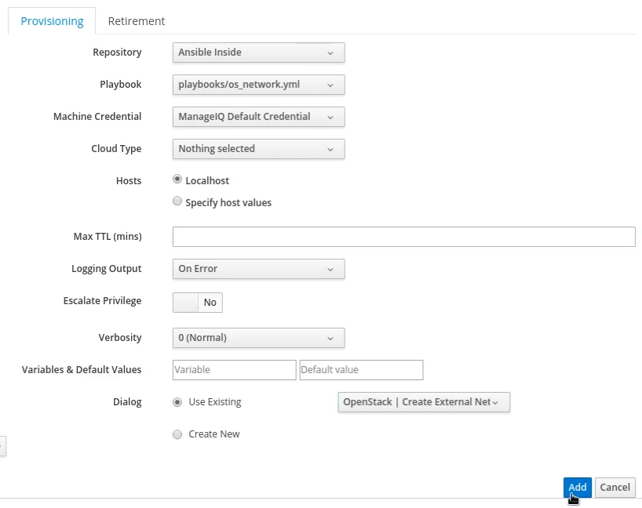
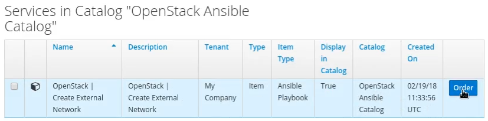
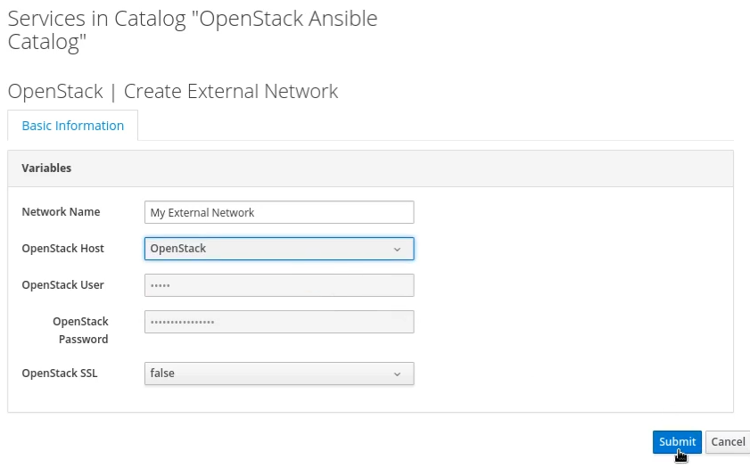
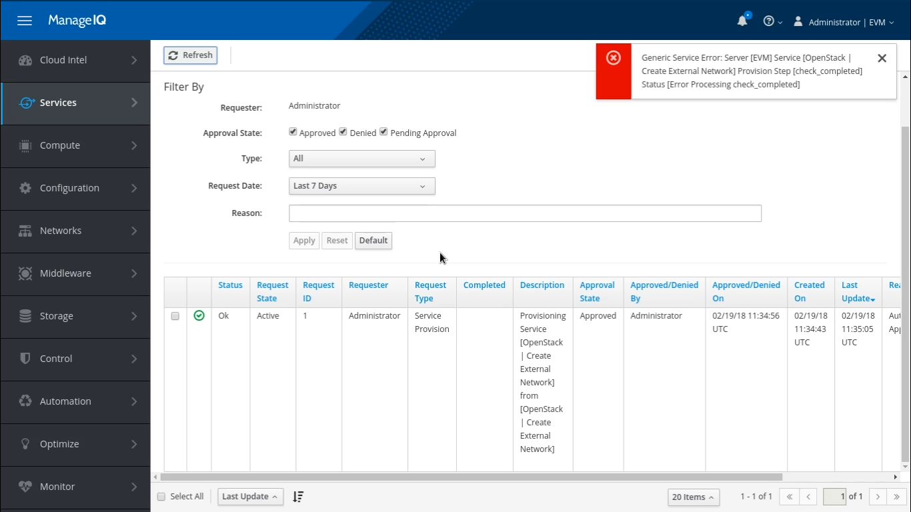

## Creating a Ansible Service

Ansible is the main pillar for the automation and playbooks are its essential part. Till now, we have seen the enabling of Ansible in ManageIQ; to know the entire picture, lets walk through it.

In our case, we will be working on creation of a external network. We can choose any functionality and write a playbook for it.

### Service Creation

As till now, you have done with the integration and enabling of Embedded Ansible. Now it is time for the actual working for the end user view set.

#### Creating and Importing Service Dialog

1. Moving ahead, you need to navigate from **Automation &rarr; Automate &rarr; Customization**.

2. You will land on page where you need to import the service dialog.

3. Select the dialog file from the playbook in the Choose file field.

4. Click on Upload button to import the dialog file.
   

5. You will get a list of service dialogs.

6. Select the dialog you wish to add from the playbook.

7. Commit the changes and go ahead.

You can view the service dialog in graphical view in the *Service Dialogs* section. You can see the list of service dialogs here and you can go through it by just on a click.

In our case, this service is for creation of external network that would collect the details from the user like network name, OpenStack host, its credentials and SSL options.

#### Creating Catalog

Next, it is required to create a catalog. For this, follow these steps

1. Navigate to **Services &rarr; Catalogs**.

2. Go to catalogs section.

3. Go through **Configurations &rarr; Add New Catalog**.

4. Give a appropriate name to the catalog.

5. Click the Add button to save the changes.

#### Adding catalog item

After the creation of catalog you need to add items to this catalog. For that,

1. Select the Catalog Items section in **Services &rarr; Catalogs**.

2. Here, you can see a list of catalogs created.

3. Select a catalog you want to work on.

4. Walk through **Configuration &rarr; Add New Catalog Item**.

5. Select Ansible playbook as a catalog item type from the dropdown menu.

6. Add a appropriate name to the catalog item what ever you think is good.

7. Give a description to this catalog item.

8. Enable the option of displaying the item in catalog. By default, it is disabled.

9. Select the catalog you wish to work on and have been added before as we have seen it previously.

10. Select the repo you want your catalog item to run on. We have already added this repo in [**_chapter_3_**](chapter_3/embedded_ansible.md).

11. Select the playbook you need your user to avail the facility. In our case, we are working on network playbook.

12. Give proper ManageIQ Credentials from the drop down menu.

13. Select a proper Cloud Type. By default nothing is selected.

14. Host is to be selected. Localhost is the default choice.

15. Log out on error. This is by default.

16. As we have already added the dialog, we will choose existing dialog.

17. Select the added service dialog for the catalog item.

18. Select the Add button to save the changes.

This will show you the details about the catalog. You can view the brief summary of the catalog right from its creation, number of playbooks, etc on just click.

### Ordering Service

So now, you are almost done with everything like Dialog, Creating a catalog, Catalog item and now it is time to order our service. For this,

1. Travel to *Service Catalog* section by **Services &rarr; Catalogs**. In this section you can see the list of services that are ready to order.

2. In our case *Create External Network* service catalog is ready to order.

3. Click on the Order button and go ahead.
   

4. You will land on the dialog page that we have already added. A user has to fill in all the details for ordering a service.

5. Fill in the appropriate name for the network.

6. Select a OpenStack host from the drop down list.

7. Fill in the required credentials. This is done by the machine itself.

8. Select SSL settings for the network you are creating. By default, it is false.

9. Click the Submit button to proceed your request.

You could see the task for the ordered service in the Requests section with all the details like request id, requester, type of request, state of order, creation date etc.

 

---

### Issue Faced

We faced the issue related the Generic Server Error. We are still working on it. The error is filed at ManageIQ as well.

---
 
