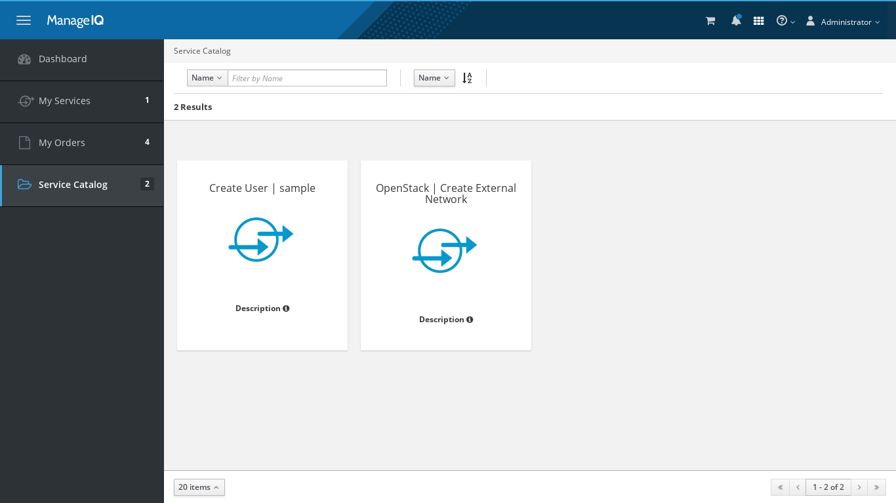

### Introduction to ManageIQ services

 Services are one of the most interesting feature within ManageIQ. Services can include one or more virtual machines, instances, etc. that can be deployed across hybrid environments.

### User self-service portal

User can use the services by self-service portal.
It can be accessed by https://your_manageiq_appliance/self_service/

### Service Basics

#### Provision Dialogs

When user is about to provision a VM or instance via ManageIQ, you are presented with a Provisioning Dialog where you set certain options for the VM or instance. The options presented are dependent on the provider you are using.

#### Service Dialogs

Service Dialog is the skeleton of a form.To create service dialog, ManageIQ includes simple form designer.

#### Service Catalogs

A Service Catalog which is used to group Services Dialogs together.
Following is the image of service catalog in our case.

#### Service Catalog items

A Service Catalog Item (ie. the actual Service) which joins a Service Dialog with a Provisioning Dialog.
